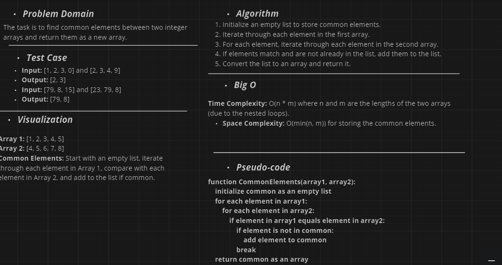
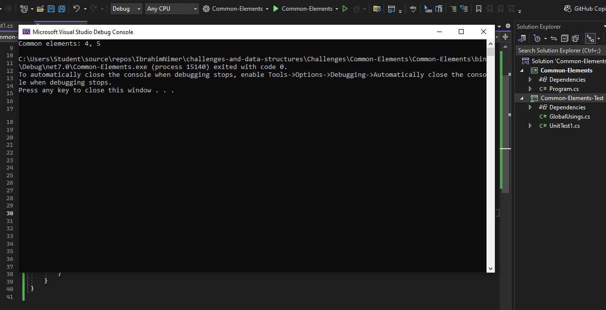

# Common Elements Challenge

## Challenge Description

Write a function called `CommonElements` that accepts two arrays as parameters. The function should return an array containing the common elements found in both input arrays without using any built-in methods for set operations.

## The whiteboard image 

## Console output

