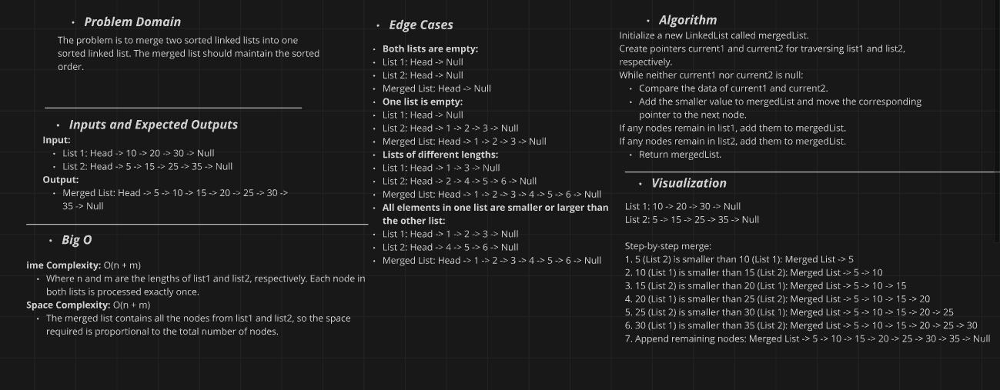
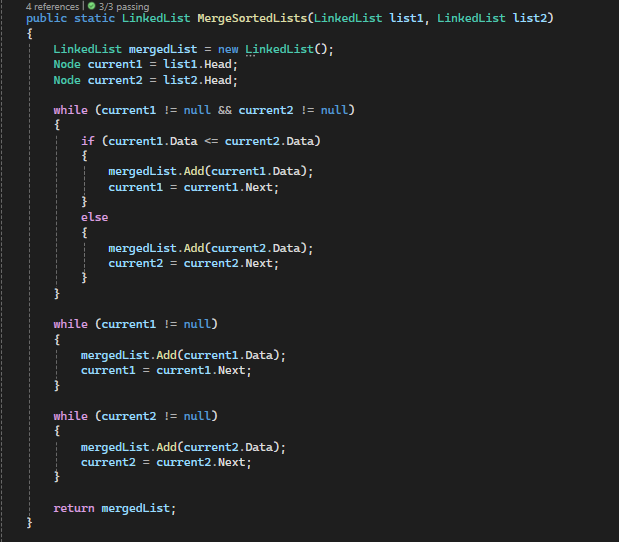

# Linked List Implementation Challenge

## Challenge Description

Merge two sorted linked lists into one sorted linked list. The merged list should maintain the sorted order.
Additionally, write unit tests using xUnit to verify the `MergedLists` 

## Whiteboard Diagram

Here is a visual representation of the linked list and the operation performed:

### Merge Lists Operation

## Merging Two Sorted Linked Lists

1. **Initialize**:
   - `current1` to the head of `list1`.
   - `current2` to the head of `list2`.
   - A new `LinkedList` called `mergedList`.

2. **Traverse** both lists:
   - While both `current1` and `current2` are not null:
     - If `current1.Data` is less than or equal to `current2.Data`:
       - Add `current1.Data` to `mergedList`.
       - Move `current1` to the next node.
     - Otherwise:
       - Add `current2.Data` to `mergedList`.
       - Move `current2` to the next node.

3. **Handle remaining nodes** in either list:
   - If `current1` is not null, add the remaining nodes from `list1` to `mergedList.
   - If `current2` is not null, add the remaining nodes from `list2` to `mergedList.

4. **Return** the `mergedList`.

## The Real Code

