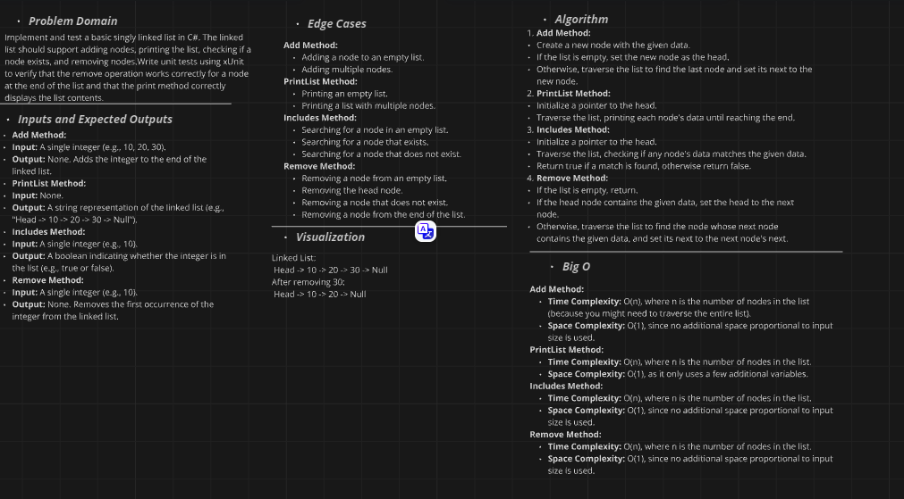

# Linked List Implementation Challenge

## Challenge Description

Implement a singly linked list in C# with the following methods:

- `Add(int data)`: Adds a node with the given data to the end of the list.
- `PrintList()`: Prints the contents of the list.
- `Includes(int data)`: Checks if a node with the given data is in the list.
- `Remove(int data)`: Removes the first node with the given data from the list.

Additionally, write unit tests using xUnit to verify the `Remove` method and the `PrintList` method.

## Whiteboard Diagram

Here is a visual representation of the linked list and the operations performed:

### Add Operation
1. Create a new node.
2. Traverse to the end of the list.
3. Add the new node at the end.

### PrintList Operation
1. Traverse the list from the head.
2. Print each node's data.

### Includes Operation
1. Traverse the list from the head.
2. Check if any node's data matches the given data.

### Remove Operation
1. Check if the list is empty.
2. If the head node matches the given data, update the head to the next node.
3. Otherwise, traverse the list to find the node before the one to be removed, and update its next pointer.

## The Real Code

