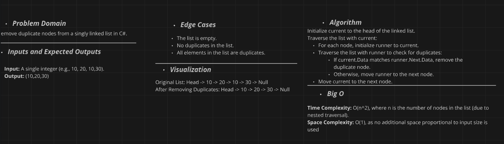
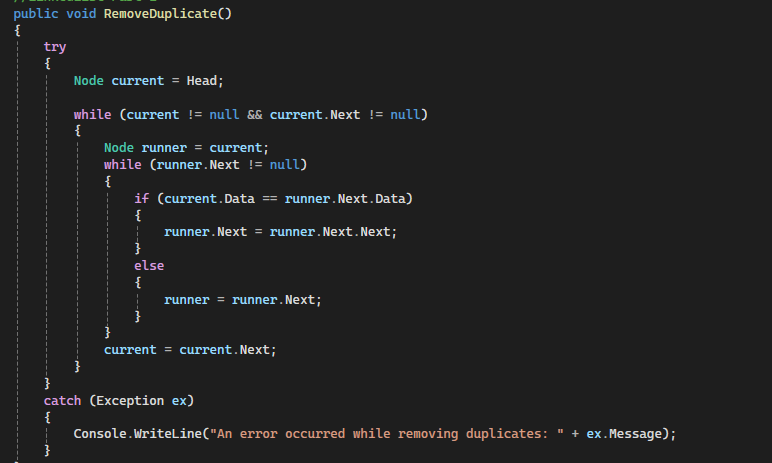

# Linked List Implementation Challenge

## Challenge Description

Remove duplicate nodes from a singly linked list in C#.

Additionally, write unit tests using xUnit to verify the `RemoveDuplicates` 

## Whiteboard Diagram

Here is a visual representation of the linked list and the operation performed:

### Remove Duplicates Operation

1. Initialize `current` to the head of the linked list.
2. Traverse the list with `current`:
   - For each node, initialize `runner` to `current`.
   - Traverse the list with `runner` to check for duplicates:
     - If `current.Data` matches `runner.Next.Data`, remove the duplicate node.
     - Otherwise, move `runner` to the next node.
   - Move `current` to the next node.

## The Real Code

