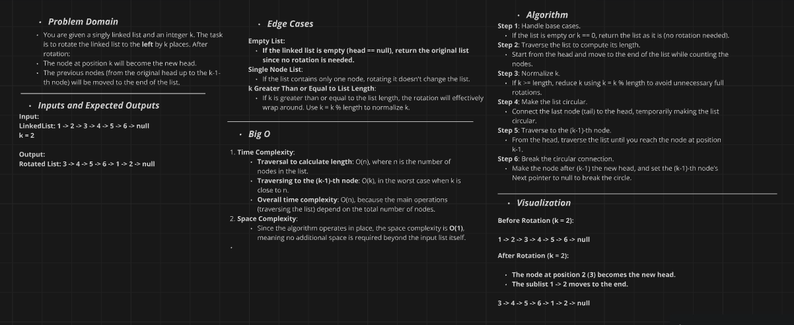
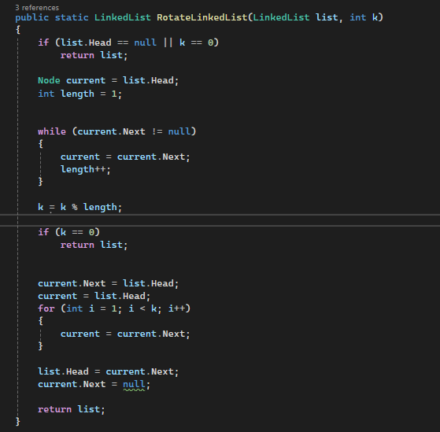

# Linked List Rotation Challenge

## Challenge Description

Rotate a singly linked list to the left by `k` places in C#.

The goal is to shift the linked list such that the node at position `k` becomes the new head, and the remaining nodes follow. If `k` is larger than the list length, normalize `k` by calculating `k % length`.

Additionally, write unit tests using xUnit to verify the `RotateLinkedList` method.

## Whiteboard Diagram

Here is a visual representation of the linked list rotation process:

### Rotate Linked List Operation

1. **Calculate the Length**: Traverse the linked list to determine its length.
2. **Normalize `k`**: If `k` is larger than the list length, reduce `k` by calculating `k % length`.
3. **Form a Circular Linked List**: Link the last node to the head to create a circular linked list.
4. **Find the New Head**: Move the pointer to the `(k-1)`-th node.
5. **Update the Head and Break the Circle**: Set the new head to the node after the `(k-1)`-th node, and break the circular connection.

## The Real Code

Here’s the C# implementation of the `RotateLinkedList` method:

