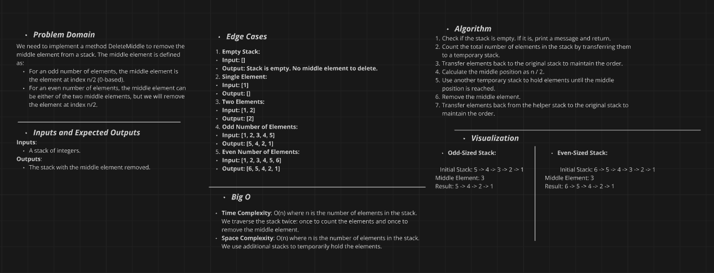
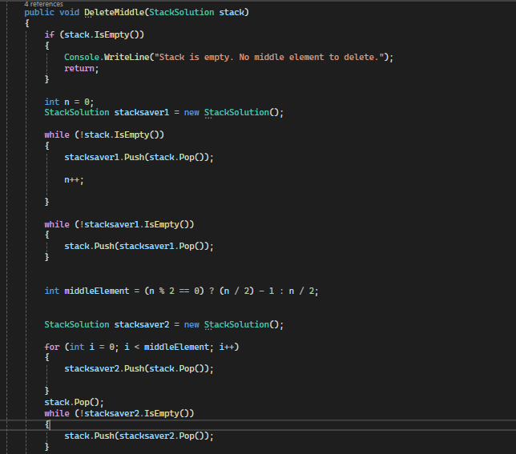

## StackWithDeleteMiddle

The `DeleteMiddle` method in the `StackWithDeleteMiddle` class effectively removes the middle element from a given stack. It operates by:

* **Calculating the middle index:** Determines the position of the middle element based on the stack's size.
* **Transferring elements:** Temporarily moves elements from the original stack to an auxiliary stack until the middle element is reached.
* **Deleting the middle:** Removes the middle element from the original stack.
* **Restoring the stack:** Transfers elements back from the auxiliary stack to the original stack, preserving the original order of the remaining elements.

The method handles scenarios where the stack is empty or contains an odd number of elements.

## Whiteboard Diagram

## The Real Code

