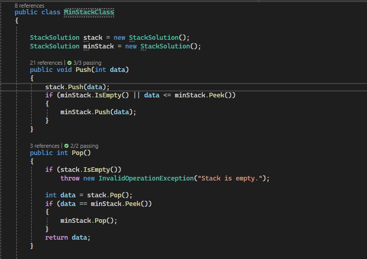

## MinStack Challenge

# StackWithMin Class

The `StackWithMin` class provides additional functionality to a standard stack by keeping track of the minimum element at all times. This class is designed to support efficient retrieval of the minimum element in constant time, in addition to the usual stack operations.

## Methods Overview

- **Push(int data):** Adds an element to the stack and updates the minimum stack if the new element is smaller than or equal to the current minimum.
- **Pop():** Removes and returns the top element from the stack. Also updates the minimum stack if the removed element is the current minimum.
- **Top():** Returns the top element of the stack without removing it.
- **IsEmpty():** Checks if the stack is empty.
- **GetMin():** Returns the minimum element in the stack.
- **PrintStack():** Prints the elements of the stack.

## Whiteboard Diagram

## The Real Code

