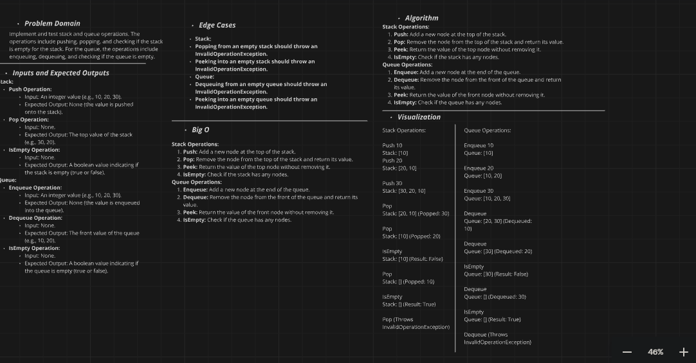
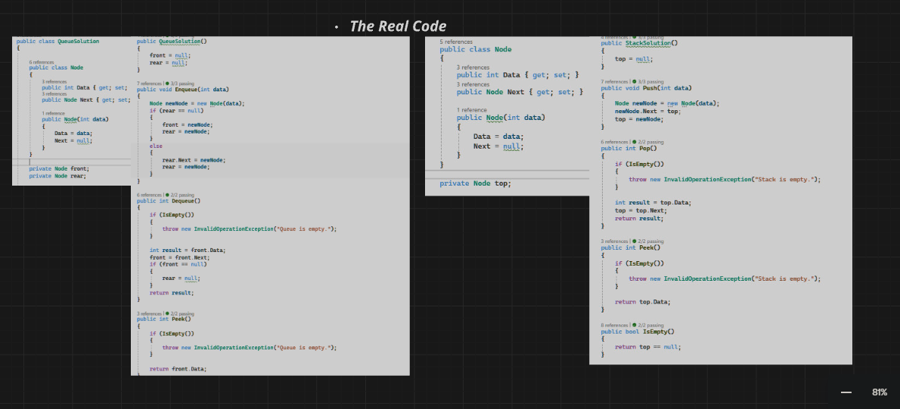

# Stack and Queue Implementation Challenge

## Challenge Description

Implement stack and queue data structures in C# with the following methods:

### Stack Methods:
- `Push(int data)`: Adds an element to the top of the stack.
- `Pop()`: Removes and returns the top element of the stack.
- `Peek()`: Returns the top element without removing it.
- `IsEmpty()`: Checks if the stack is empty.

### Queue Methods:
- `Enqueue(int data)`: Adds an element to the end of the queue.
- `Dequeue()`: Removes and returns the front element of the queue.
- `Peek()`: Returns the front element without removing it.
- `IsEmpty()`: Checks if the queue is empty.

Additionally, write unit tests using xUnit to verify the methods for both stack and queue.

## Whiteboard Diagram

Here is a visual representation of the stack and queue operations:

### Stack Operations
- **Push Operation**: Add a new element to the top of the stack.
- **Pop Operation**: Remove and return the top element from the stack.
- **Peek Operation**: Return the top element without removing it.
- **IsEmpty Operation**: Check if the stack contains any elements.

### Queue Operations
- **Enqueue Operation**: Add a new element to the end of the queue.
- **Dequeue Operation**: Remove and return the front element from the queue.
- **Peek Operation**: Return the front element without removing it.
- **IsEmpty Operation**: Check if the queue contains any elements.

## The Real Code

