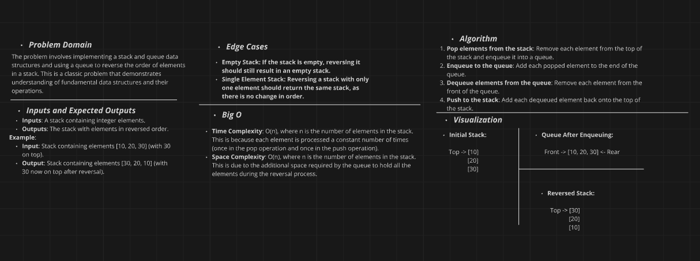
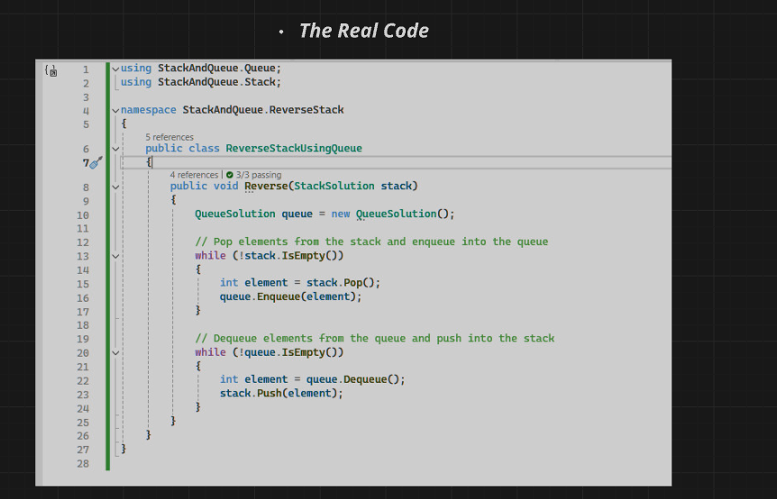

## ReverseStackUsingQueue

The `ReverseStackUsingQueue` class provides a method to reverse the elements of a stack using a queue. It pops all elements from the stack, enqueues them into the queue, then dequeues each element from the queue and pushes it back onto the stack. This effectively reverses the order of the stack.

## Whiteboard Diagram

## The Real Code

