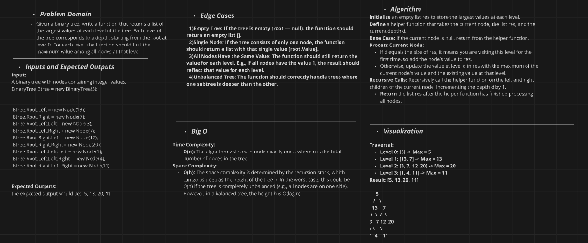

# Binary Tree Largest Level Value Implementation Challenge

## Challenge Description
Implement a method to find the largest value at each level of a binary tree. The method should traverse the binary tree and return a list of the largest values at each level, starting from the root level (level 0).

### Methods:
- **`LargestValues(Node root)`**: This method initiates the process to find the largest value at each level of the binary tree. It leverages a helper function to recursively traverse the tree.
  
- **`Helper(List<int> res, Node root, int d)`**: This helper method is used to traverse the binary tree. It checks whether the current level (depth `d`) is being visited for the first time. If so, it adds the current node’s value to the results list. If not, it updates the existing value in the list with the maximum of the current node’s value and the previously stored value for that level.

## Whiteboard Diagram



## The Real Code

```csharp
public static void Helper(List<int> largest,
                   Node root, int level)
        {
            if (root == null)
                return;


            if (level == largest.Count)
                largest.Add(root.Value);

            else


                largest[level] = Math.Max(largest[level], root.Value);


            Helper(largest, root.Left, level + 1);
            Helper(largest, root.Right, level + 1);
        }

        public static List<int> LargestValues(Node root)
        {
            List<int> level = new List<int>();
            Helper(level, root, 0);
            return level;
        }
