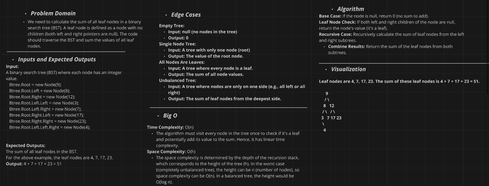

# Binary Tree Leaf Sum Implementation Challenge

## Challenge Description
Implement a method to calculate the sum of all leaf nodes in a binary tree. A leaf node is defined as a node with no children (both left and right pointers are `null`). The method should traverse the binary tree and return the sum of the values of all leaf nodes.

### Method:
- **`LeafSum(Node node)`**: Traverses the binary tree and calculates the sum of all leaf nodes by recursively checking if a node is a leaf (both left and right children are `null`). If it is, the node's value is added to the sum.


## Whiteboard Diagram



## The Real Code

```csharp
public int LeafSum(Node node) 
        {
            if (node == null)
            {
                return 0;
            }

            if (node.Left == null && node.Right == null)
            {
                return node.Value;
            }

            return LeafSum(node.Left) + LeafSum(node.Right);
        }
