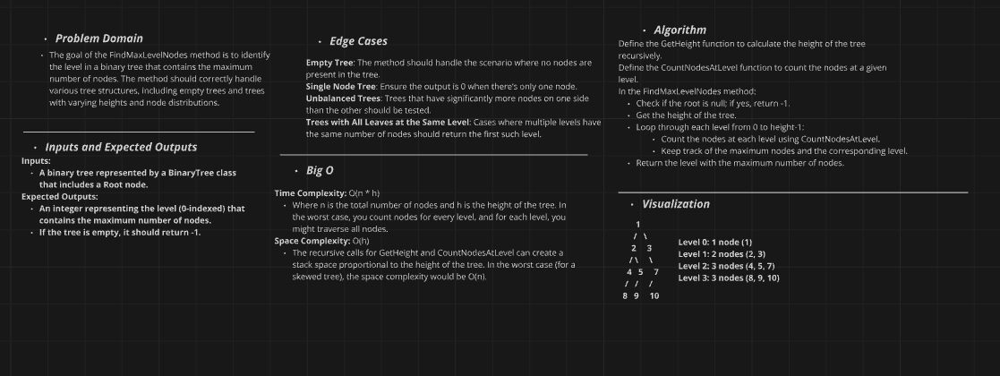

# Binary Tree Max Level Nodes Implementation Challenge

## Challenge Description
Implement a method to find the level of a binary tree that has the maximum number of nodes. The level with the maximum nodes is defined as the one where the count of nodes is higher than any other level.

### Method:
- **`FindMaxLevelNodes()`**: Returns the level with the maximum number of nodes.

### Utility Methods:
- **`GetHeight(Node node)`**: A helper method that calculates the height of the tree.
- **`CountNodesAtLevel(Node node, int level)`**: A helper method that counts the number of nodes at a specific level.

## Whiteboard Diagram


## The Real Code
```csharp
// Helper function to get the height of the tree
        public int GetHeight(Node node)
        {
            if (node == null)
                return 0;

            int leftHeight = GetHeight(node.Left);
            int rightHeight = GetHeight(node.Right);

            return Math.Max(leftHeight, rightHeight) + 1;
        }

        // Helper function to count nodes at a given level
        public int CountNodesAtLevel(Node node, int level)
        {
            if (node == null)
                return 0;

            if (level == 0)
                return 1;

            int leftCount = CountNodesAtLevel(node.Left, level - 1);
            int rightCount = CountNodesAtLevel(node.Right, level - 1);

            return leftCount + rightCount;
        }

        // Method to find the level with the maximum number of nodes
        public int FindMaxLevelNodes()
        {
            if (Root == null)
            {
                Console.WriteLine("The tree is empty.");
                return -1; // Return -1 for an empty tree
            }

            int treeHeight = GetHeight(Root);
            int maxNodes = 0;
            int maxLevel = 0;

            for (int level = 0; level < treeHeight; level++)
            {
                int nodeCount = CountNodesAtLevel(Root, level);
                if (nodeCount > maxNodes)
                {
                    maxNodes = nodeCount;
                    maxLevel = level;
                }
            }

            return maxLevel;
        }
