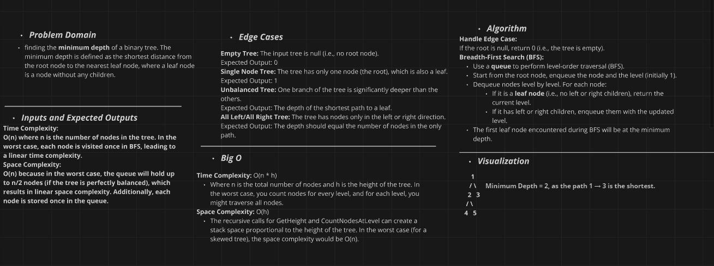

# Binary Tree Minimum Depth Implementation Challenge

## Challenge Description

Implement a method to calculate the minimum depth of a binary tree. The minimum depth is defined as the number of nodes along the shortest path from the root node down to the nearest leaf node.

### Method:
- **`FindMinDepth()`**: Returns the minimum depth of the binary tree.

### Utility Method:
- **`FindMinDepthUtil(Node node)`**: A helper method that recursively calculates the minimum depth of the tree.

## Whiteboard Diagram



## The Real Code

```csharp
public int FindMinDepth()
{
    return FindMinDepthUtil(Root);
}

public int FindMinDepthUtil(Node node)
{
    if (node == null)
        return 0;

    if (node.Left == null && node.Right == null)
        return 1;

    if (node.Left == null)
        return FindMinDepthUtil(node.Right) + 1;

    if (node.Right == null)
        return FindMinDepthUtil(node.Left) + 1;

    return Math.Min(FindMinDepthUtil(node.Left), FindMinDepthUtil(node.Right)) + 1;
}
