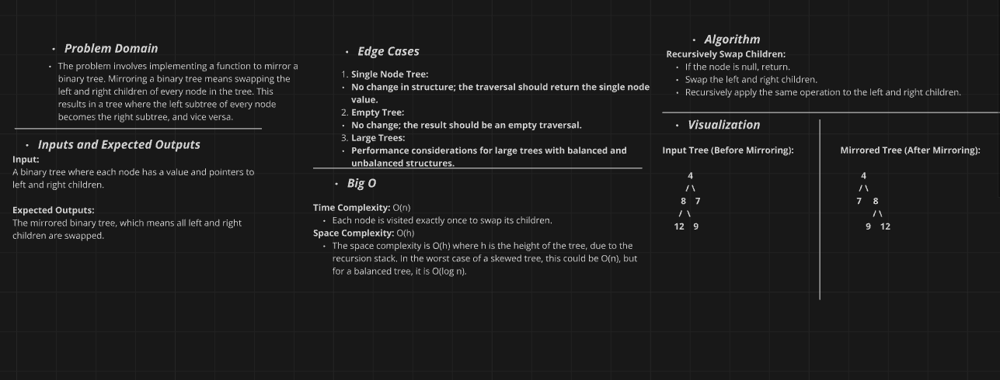

# Binary Tree Mirror Implementation Challenge

## Challenge Description

Implement a method to convert a binary tree into its mirror image. The mirror image of a binary tree is obtained by swapping the left and right children of every node in the tree.

### Method:
- **`MirrorTree(Node root)`**: Converts the binary tree into its mirror image by recursively swapping the left and right children of each node.


## Whiteboard Diagram



## The Real Code

```csharp
public void MirrorTree(Node node)
        {
            if (node == null) return;

            
            Node temp = node.Left;
            node.Left = node.Right;
            node.Right = temp;

            
            MirrorTree(node.Left);
            MirrorTree(node.Right);
        }
