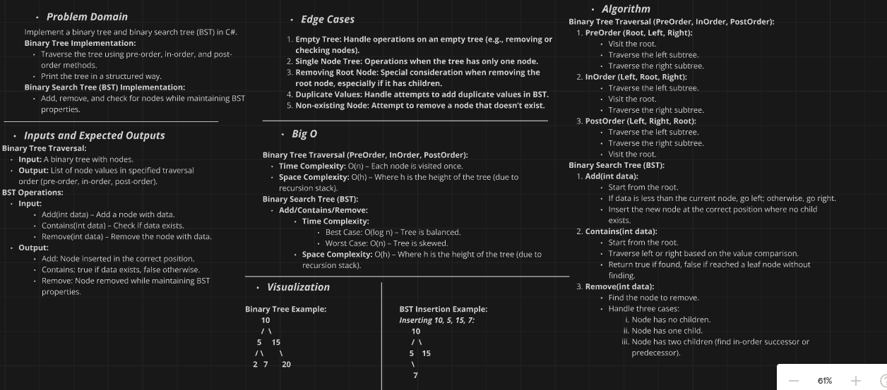
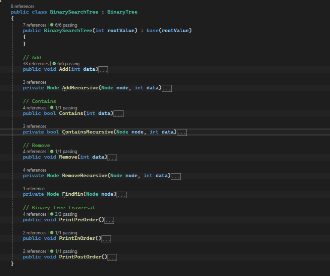

# Binary Tree and Binary Search Tree Implementation Challenge

## Challenge Description

Implement binary tree and binary search tree (BST) data structures in C# with the following methods:

### Binary Tree Methods:
- **`PreOrder()`**: Traverse the tree in pre-order (Root, Left, Right).
- **`InOrder()`**: Traverse the tree in in-order (Left, Root, Right).
- **`PostOrder()`**: Traverse the tree in post-order (Left, Right, Root).
- **`Print()`**: Display the tree in the console in a structured way.

### Binary Search Tree (BST) Methods:
- **`Add(int data)`**: Add a node with the specified data to the correct location to maintain BST properties.
- **`Contains(int data)`**: Check if a node with the specified data exists in the tree.
- **`Remove(int data)`**: Remove the node with the specified data while maintaining BST properties.

Additionally, handle all exceptions that could be thrown during execution, and write unit tests using xUnit to verify the methods for both the binary tree and BST.

## Whiteboard Diagram

Here is a visual representation of the binary tree and binary search tree operations:

### Binary Tree Operations
- **PreOrder Traversal**: Visit the root, then traverse the left subtree, followed by the right subtree.
- **InOrder Traversal**: Traverse the left subtree, visit the root, then traverse the right subtree.
- **PostOrder Traversal**: Traverse the left subtree, traverse the right subtree, and then visit the root.

### Binary Search Tree Operations
- **Add Operation**: Insert a new node with the specified data into the correct position to maintain BST properties.
- **Contains Operation**: Check if a node with the specified data exists in the BST.
- **Remove Operation**: Remove the node with the specified data, ensuring that BST properties are preserved.

## The Real Code

