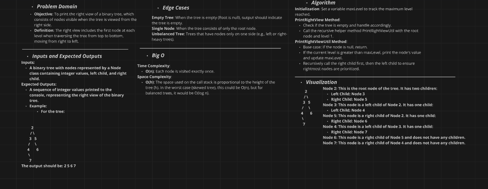

# Binary Tree Right View Implementation Challenge

## Challenge Description

Implement a method to print the right view of a binary tree. The right view of a binary tree is defined as the set of nodes visible when the tree is viewed from the right side.

### Method:
- **`PrintRightView()`**: Prints the right view of the binary tree by traversing it and keeping track of the maximum level reached.

### Utility Method:
- **`PrintRightViewUtil(Node node, int currentLevel)`**: A helper method that recursively traverses the tree, printing the first node encountered at each level.

## Whiteboard Diagram



## The Real Code

```csharp
private int maxLevel = 0;

public void PrintRightView()
{
    try
    {
        if (Root == null)
        {
            Console.WriteLine("The tree is empty.");
            return;
        }

        PrintRightViewUtil(Root, 1);
    }
    catch (Exception ex)
    {
        Console.WriteLine($"An error occurred: {ex.Message}");
    }
}

public void PrintRightViewUtil(Node node, int currentLevel)
{
    if (node == null)
        return;

    if (maxLevel < currentLevel)
    {
        Console.WriteLine(node.Value);
        maxLevel = currentLevel;
    }

    PrintRightViewUtil(node.Right, currentLevel + 1);
    PrintRightViewUtil(node.Left, currentLevel + 1);
}
