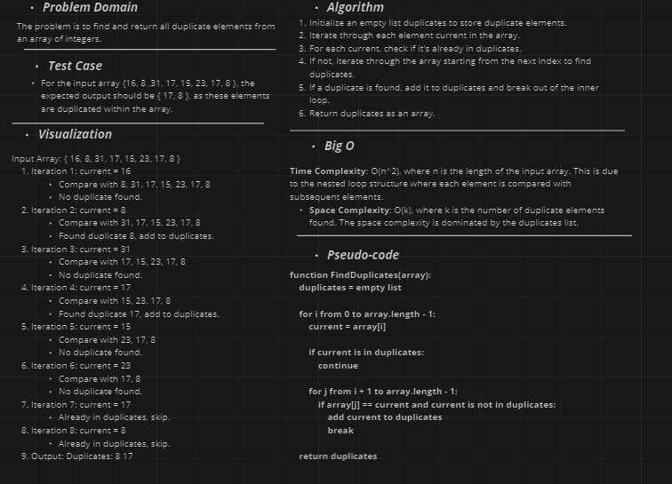
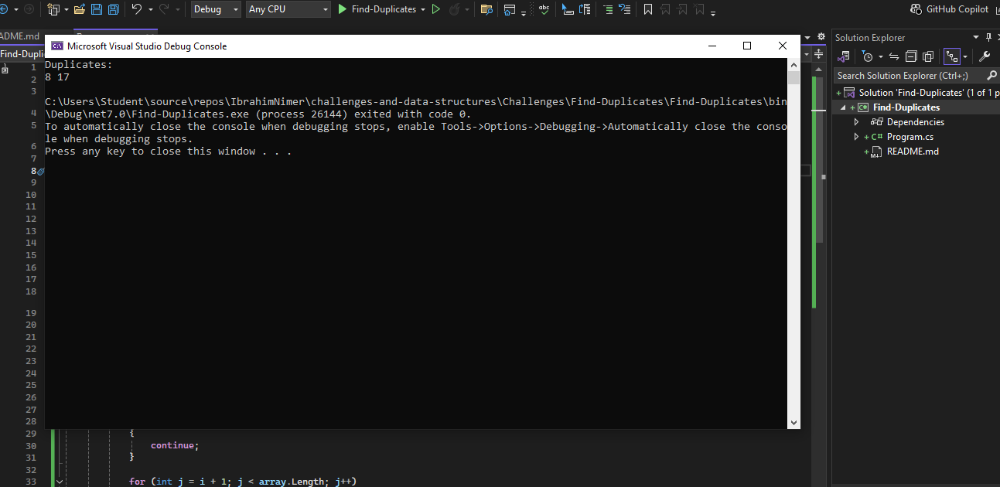

# Find Duplicates Challenge

## Challenge Description

Write a function called `FindDuplicates` that accepts an array as its parameter. The function should return an array containing duplicate values found in the input array, without using any built-in methods provided by the language.

## The whiteboard image 

##  Console output

