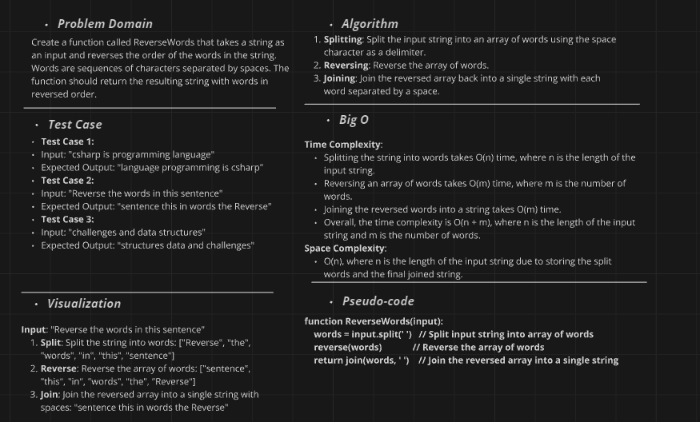
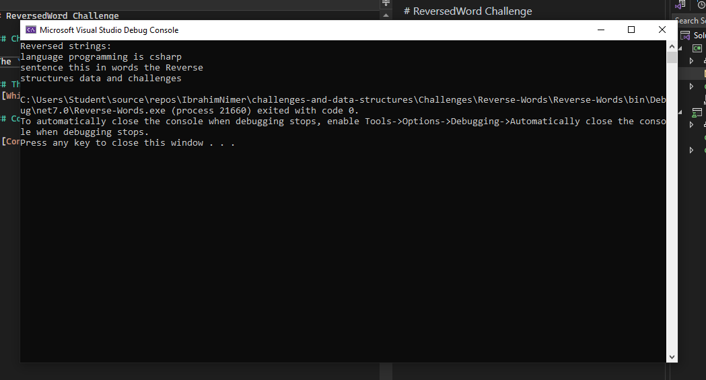

# ReversedWord Challenge

## Challenge Description

The `ReversedWord` challenge involves writing a program that reverses the order of words in given input strings using C#.

## The whiteboard image 

## Console output

